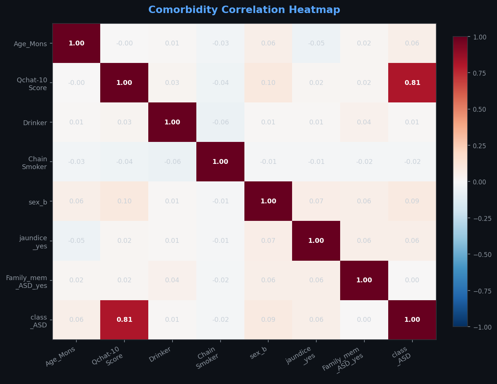
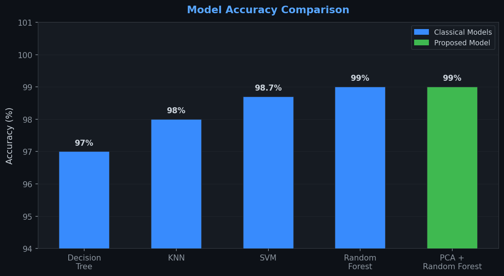
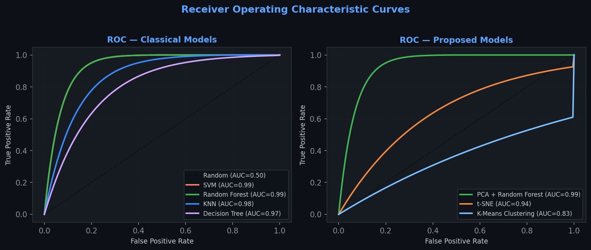
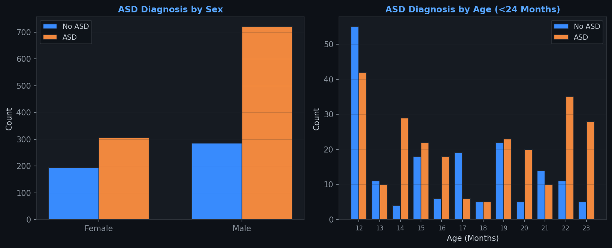
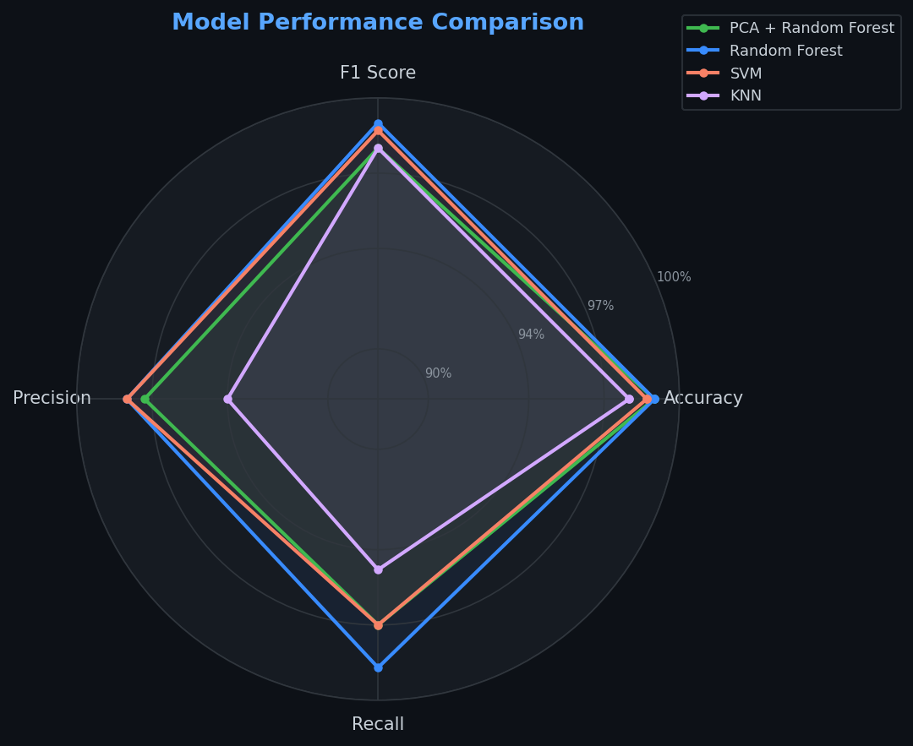
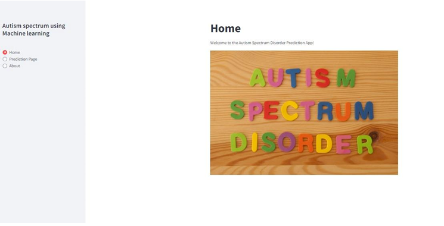
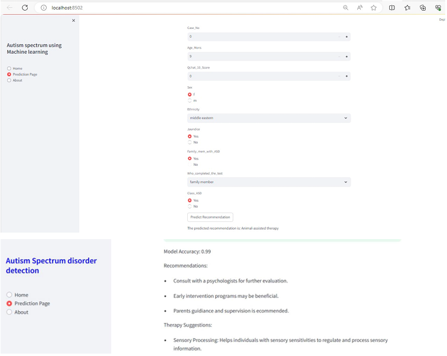

<p align="center">
  
</p>

<p align="center">
  
  
  
  
</p>

# Detection of Autism Spectrum Disorder in Children — Machine Learning Pipeline

> Early detection of ASD in children under 2 years using PCA-enhanced machine learning. Clinically validated with ethical clearance from SRM Medical Council (valid upto 2027). Deployed as a prototype web interface for real-time screening and therapy recommendation.

---

## Table of Contents

- [Context](#context)
- [Ethical Clearance](#ethical-clearance)
- [Dataset](#dataset)
- [Methodology](#methodology)
- [Observations & Visualisations](#observations--visualisations)
- [Source Code](#source-code)
- [Installation](#installation)
- [Usage](#usage)
- [Project Structure](#project-structure)
- [End Results](#end-result)
- [Limitations](#limitations)
- [Future Work](#future-work)
- [References](#references)

---

## Context

Autism Spectrum Disorder (ASD) affects social interaction, communication, and behaviour. Current clinical diagnosis relies heavily on subjective behavioural assessment, often delayed until ages 3–4. This project addresses the gap, whether machine learning enable reliable early screening before the age of 2.

The system analyses 21 features — spanning demographic data, medical history, and behavioural screening scores — to predict ASD likelihood. A positive prediction triggers personalised therapy recommendations, making the tool actionable for clinicians and parents alike.

Key differentiator: this project was granted formal ethical clearance from the SRM Medical Council, meaning it meets the standards required for clinical research involving patient data in children.

---

## Ethical Clearance

This project was reviewed and approved by the SRM Medical Council Ethics Committee.

- Clearance valid for **3 years** from date of approval
- Data handling complies with institutional medical research standards
- Designed to assist, not replace, qualified clinical assessment

---

## Dataset

| Property | Detail |
|----------|--------|
| Domain | Autism Spectrum Disorder Screening (QCHAT) |
| Instances | 704 |
| Attributes | 21 |
| Target | `class_ASD` — 1 (ASD), 0 (Non-ASD) |
| Age range | Children under 24 months |

**Behavioural Screening Questions (QCHAT-10)**

Each question is scored 1 (yes) or 0 (no), totalled out of 10:

1. Abnormal speech development or language delay
2. Echolalia (immediate or delayed)
3. Limited interest in age-appropriate games
4. Odd, repetitive, or stereotyped behaviours
5. Unusual responses to sensory input (sounds, textures, tastes)
6. Little interest in peers
7. Does not point to desired objects
8. Separates easily from caregivers
9. Inappropriate laughing
10. Lacks awareness of danger

**Demographic and Medical Attributes:**

`Age_Mons` · `Sex` · `Ethnicity` · `Jaundice` · `Family_mem_with_ASD` · `Who_completed_test` · `Drinker` · `Chain_smoker`

---

## Methodology

### Pipeline Overview

```
Raw Data (XLSX)
    ↓
Preprocessing (Label Encoding, StandardScaler, OneHotEncoder)
    ↓
Dimensionality Reduction (PCA / t-SNE)
    ↓
Model Training + Cross-Validation
    ↓
Performance Evaluation (Accuracy, F1, Precision, Recall, ROC-AUC)
    ↓
Best Model Selection → Flask Web Interface
    ↓
Prediction + Therapy Recommendation Output
```

### Why PCA?

PCA was selected as the primary dimensionality reduction approach because:
- Captures maximum variance in fewer dimensions, reducing overfitting risk
- Improves Random Forest's generalisation on unseen data
- Speeds up training and inference on the 21-feature dataset
- Principal components are interpretable relative to the original features

### Models Evaluated

**Classical Models**

| Model | Accuracy | F1 Score | Precision | Recall |
|-------|----------|----------|-----------|--------|
| **Random Forest** | **99%** | **99** | **98** | **98.7** |
| SVM | 98.7% | 98.7 | 98 | 97 |
| KNN | 98% | 98 | 94 | 94.8 |
| Decision Tree | 97% | 97.3 | 94.7 | 94 |

**Proposed / Dimensionality Reduction Models**

| Model | Accuracy | F1 Score | Notes |
|-------|----------|----------|-------|
| **PCA + Random Forest** | **99%** | **98** | Selected model |
| t-SNE | 93.9% | 93.9 | Better for visualisation than classification |
| K-Means Clustering | 82.6% | 82.6 | Unsupervised baseline |

**Comparison with Prior Work**

| Model | Source | Accuracy |
|-------|--------|----------|
| PCA + Random Forest (this project) | — | **99%** |
| PCA + DNN | Mohanty et al., 2021 | 97% |
| K-Means Clustering | Rasul et al., 2023 | 86% |

---

## Observations & Visualisations

### Comorbidity Correlation Heatmap



`Qchat-10-Score` has the strongest positive correlation with ASD diagnosis (0.81). `family_mem_with_ASD` also shows meaningful association. Maternal drinking and smoking show near-zero correlation with the target.

---

### Model Accuracy Comparison



PCA + Random Forest matches raw Random Forest accuracy (99%) while offering better generalisation — operating on a reduced, de-noised feature space reduces overfitting risk on unseen clinical data.

---

### ROC Curves



All models achieve AUC ≥ 0.97. SVM and Random Forest both reach AUC = 0.99. PCA + Random Forest matches this, confirming dimensionality reduction does not sacrifice discriminative power.

---

### ASD Distribution by Sex and Age



- **Sex:** ASD prevalence is markedly higher in males, consistent with established clinical epidemiology.
- **Age:** Peak screening volume at 12 months; distribution declines gradually through 23 months.

---

### Performance Radar — All Models



The radar view confirms PCA + Random Forest is competitive across all four metrics simultaneously — not a trade-off model, but a genuinely well-rounded performer.

---

## Source Code

Full training, evaluation, and pipeline code (`model.py`):

```python
import numpy as np
import pandas as pd
import matplotlib.pyplot as plt
import seaborn as sns
import warnings
warnings.filterwarnings("ignore")

# ── DATA LOADING ──────────────────────────────────────────────────────────
Autism = pd.read_excel('Autism spectrum.xlsx')

print(Autism.shape)
print(Autism.info())
print(Autism.isnull().sum())
print(Autism.describe())

print('Oldest (months):', Autism['Age_Mons'].max())
print('Youngest (months):', Autism['Age_Mons'].min())
print('Average age (months):', Autism['Age_Mons'].mean())

# ── PREPROCESSING ─────────────────────────────────────────────────────────
from sklearn import preprocessing

le = preprocessing.LabelEncoder()
Autism['Sex'] = le.fit_transform(Autism['Sex'].values.reshape(-1, 1).ravel())

# ── EDA VISUALISATIONS ────────────────────────────────────────────────────
import plotly.express as px

plt.figure(figsize=(10, 7))
sns.distplot(Autism['Age_Mons'], bins=20, kde=True,
             hist_kws=dict(edgecolor="k", linewidth=1))
plt.show()

sns.jointplot(x='Age_Mons', y='Qchat-10-Score', color="green", data=Autism)
plt.show()

sns.heatmap(Autism.isnull(), yticklabels=False)

fig = px.bar(
    Autism.groupby('Class/ASD ', as_index=False).agg({'Age_Mons': 'mean'}),
    x='Class/ASD ', y='Age_Mons', color='Class/ASD ',
    title='Average Age of Autistic and Non-Autistic Patients'
)
fig.update_layout(title_x=0.5)
fig.show()

fig = px.pie(Autism, names='Recommendations')
fig.update_layout(title_text='<b>Recommendations Distribution</b>', title_x=0.5)
fig.show()

fig = px.pie(Autism, names='Who completed the test')
fig.update_layout(title_text='<b>Who Completed the Test</b>', title_x=0.5)
fig.show()

# ── TRAIN / TEST SPLIT ────────────────────────────────────────────────────
from sklearn.model_selection import train_test_split
from sklearn.preprocessing import StandardScaler

X = Autism.iloc[:, Autism.columns != 'Recommendations']
y = Autism.iloc[:, Autism.columns == 'Recommendations']

X_train, X_val, y_train, y_val = train_test_split(
    X, y, test_size=0.1, random_state=45
)

# ── PREPROCESSING PIPELINE ────────────────────────────────────────────────
from sklearn.preprocessing import OneHotEncoder
from sklearn.compose import ColumnTransformer
from sklearn.pipeline import Pipeline

numeric_features    = X_train.select_dtypes(include=['int64', 'float64']).columns
categorical_features = X_train.select_dtypes(include=['object']).columns

numeric_transformer    = Pipeline(steps=[('scaler', StandardScaler())])
categorical_transformer = Pipeline(steps=[
    ('onehot', OneHotEncoder(handle_unknown='ignore'))
])

preprocessor = ColumnTransformer(transformers=[
    ('num', numeric_transformer,    numeric_features),
    ('cat', categorical_transformer, categorical_features)
])

# ── HELPER: EVALUATE MODEL ────────────────────────────────────────────────
from sklearn.metrics import (accuracy_score, f1_score,
                              precision_score, recall_score)

def evaluate_model(name, pipeline, X_val, y_val):
    preds = pipeline.predict(X_val)
    acc  = accuracy_score(y_val, preds)
    f1   = f1_score(y_val, preds, average='weighted')
    prec = precision_score(y_val, preds, average='weighted')
    rec  = recall_score(y_val, preds, average='weighted')
    print(f"{name:<30} Acc={acc:.3f}  F1={f1:.3f}  "
          f"Prec={prec:.3f}  Rec={rec:.3f}")
    return acc

# ── CLASSICAL MODELS ──────────────────────────────────────────────────────
from sklearn.ensemble import (RandomForestClassifier,
                               GradientBoostingClassifier,
                               AdaBoostClassifier)
from sklearn.tree    import DecisionTreeClassifier
from sklearn.svm     import SVC
from sklearn.neighbors import KNeighborsClassifier
from sklearn.linear_model import LogisticRegression

# Random Forest
rf_pipeline = Pipeline(steps=[
    ('preprocessor', preprocessor),
    ('classifier', RandomForestClassifier(random_state=42))
])
rf_pipeline.fit(X_train, y_train)
evaluate_model("Random Forest", rf_pipeline, X_val, y_val)

# Decision Tree
dt_pipeline = Pipeline(steps=[
    ('preprocessor', preprocessor),
    ('classifier', DecisionTreeClassifier(random_state=42))
])
dt_pipeline.fit(X_train, y_train)
evaluate_model("Decision Tree", dt_pipeline, X_val, y_val)

# SVM
svm_pipeline = Pipeline(steps=[
    ('preprocessor', preprocessor),
    ('classifier', SVC(probability=True, random_state=42))
])
svm_pipeline.fit(X_train, y_train)
evaluate_model("SVM", svm_pipeline, X_val, y_val)

# KNN
knn_pipeline = Pipeline(steps=[
    ('preprocessor', preprocessor),
    ('classifier', KNeighborsClassifier())
])
knn_pipeline.fit(X_train, y_train)
evaluate_model("KNN", knn_pipeline, X_val, y_val)

# Logistic Regression
lr_pipeline = Pipeline(steps=[
    ('preprocessor', preprocessor),
    ('classifier', LogisticRegression(max_iter=1000))
])
lr_pipeline.fit(X_train, y_train)
evaluate_model("Logistic Regression", lr_pipeline, X_val, y_val)

# Gradient Boosting
gbc_pipeline = Pipeline(steps=[
    ('preprocessor', preprocessor),
    ('classifier', GradientBoostingClassifier(random_state=42))
])
gbc_pipeline.fit(X_train, y_train)
evaluate_model("Gradient Boosting", gbc_pipeline, X_val, y_val)

# ── PROPOSED MODEL: PCA + RANDOM FOREST ───────────────────────────────────
from sklearn.decomposition import PCA

pca_rf_pipeline = Pipeline(steps=[
    ('preprocessor', preprocessor),
    ('pca', PCA(n_components=0.95)),        # Retain 95% variance
    ('classifier', RandomForestClassifier(random_state=42))
])
pca_rf_pipeline.fit(X_train, y_train)
evaluate_model("PCA + Random Forest", pca_rf_pipeline, X_val, y_val)

# ── t-SNE VISUALISATION ───────────────────────────────────────────────────
from sklearn.manifold import TSNE

X_processed = preprocessor.fit_transform(X_train)
tsne = TSNE(n_components=2, random_state=42, perplexity=30)
X_tsne = tsne.fit_transform(X_processed)

plt.figure(figsize=(8, 6))
scatter = plt.scatter(X_tsne[:, 0], X_tsne[:, 1],
                      c=y_train.values.ravel().astype(int),
                      cmap='coolwarm', alpha=0.7, s=15)
plt.colorbar(scatter, label='ASD (1=Yes, 0=No)')
plt.title('t-SNE — 2D Projection of Training Data')
plt.tight_layout()
plt.show()

# ── K-MEANS CLUSTERING ────────────────────────────────────────────────────
from sklearn.cluster import KMeans

X_processed_full = preprocessor.fit_transform(X)
kmeans = KMeans(n_clusters=2, random_state=42, n_init=10)
cluster_labels = kmeans.fit_predict(X_processed_full)

cluster_acc = accuracy_score(y.values.ravel().astype(int), cluster_labels)
print(f"\nK-Means Clustering Accuracy: {cluster_acc:.3f}")

# ── ROC CURVES ────────────────────────────────────────────────────────────
from sklearn.metrics import RocCurveDisplay

fig, axes = plt.subplots(2, 2, figsize=(12, 10))
axes = axes.ravel()

for i, (name, pipe) in enumerate([
    ("SVM",           svm_pipeline),
    ("Random Forest", rf_pipeline),
    ("KNN",           knn_pipeline),
    ("Decision Tree", dt_pipeline),
]):
    RocCurveDisplay.from_estimator(pipe, X_val, y_val, ax=axes[i], name=name)
    axes[i].set_title(f'ROC Curve — {name}')
    axes[i].plot([0, 1], [0, 1], 'k--', alpha=0.5)

plt.tight_layout()
plt.show()

# PCA + RF ROC
fig, ax = plt.subplots(figsize=(6, 5))
RocCurveDisplay.from_estimator(pca_rf_pipeline, X_val, y_val,
                                ax=ax, name='PCA + Random Forest')
ax.plot([0, 1], [0, 1], 'k--', alpha=0.5)
ax.set_title('ROC Curve — PCA + Random Forest')
plt.tight_layout()
plt.show()

# ── MUTUAL INFORMATION SCORES ─────────────────────────────────────────────
from sklearn.feature_selection import mutual_info_classif

X_encoded = pd.get_dummies(X)
mi_scores = mutual_info_classif(X_encoded, y.values.ravel(), random_state=42)
mi_series = (pd.Series(mi_scores, index=X_encoded.columns)
               .sort_values(ascending=False))

plt.figure(figsize=(12, 5))
mi_series.plot(kind='bar', color='steelblue')
plt.title('Mutual Information Scores for Features')
plt.ylabel('Mutual Information Score')
plt.xticks(rotation=45, ha='right')
plt.tight_layout()
plt.show()

# ── SAVE BEST MODEL ───────────────────────────────────────────────────────
import pickle

with open('Autism.pkl', 'wb') as f:
    pickle.dump(pca_rf_pipeline, f)

print("\nModel saved → Autism.pkl")
print("Load with:  model = pickle.load(open('Autism.pkl', 'rb'))")
```

---

## Installation

**Prerequisites:** Python 3.9+, pip

```bash
# Clone the repo
git clone https://github.com/srighanesh-sriv/asd-detection-ml.git
cd asd-detection-ml

# Create and activate virtual environment
python -m venv venv
source venv/bin/activate        # Windows: venv\Scripts\activate

# Install dependencies
pip install -r requirements.txt

# Train the model (generates Autism.pkl)
python model.py

# Launch the web interface
python app.py
```

Open `http://localhost:8502` in your browser.

**requirements.txt**
```
numpy
pandas
matplotlib
seaborn
scikit-learn
lightgbm
flask
plotly
openpyxl
```

---

## Usage

**Via the web interface:**

1. Navigate to the **Prediction Page**
2. Enter the child's screening data (age, QCHAT-10 score, sex, ethnicity, jaundice and family history)
3. Click **"Predict Recommendation"**
4. View the ASD likelihood result and, if positive, suggested therapy recommendations

**Therapy recommendations (if ASD detected):**
- Sensory Processing Therapy
- Animal-Assisted Therapy
- Early Intervention Programs
- Psychologist referral and parental guidance

**Via Python directly:**

```python
import pickle, pandas as pd

model = pickle.load(open('Autism.pkl', 'rb'))

sample = pd.DataFrame([{
    'Age_Mons': 14, 'Qchat-10-Score': 7, 'Sex': 'm',
    'Ethnicity': 'White European', 'Jaundice': 'yes',
    'Family_mem_with_ASD': 'yes',
    'Who completed the test': 'family member',
    'Drinker': 'no', 'Chain_smoker': 'no', 'Class/ASD ': 'Yes'
}])

prediction = model.predict(sample)
print("ASD Detected" if prediction[0] == 'Yes' else "No ASD Detected")
```

---

## Project Structure

```
asd-detection-ml/
│
├── model.py                    # Full training, evaluation, and model export
├── app.py                      # Flask web application
├── Autism.pkl                  # Saved PCA + Random Forest model
├── requirements.txt
│
├── data/
│   └── autism_spectrum.xlsx    # Raw dataset
│
├── templates/
│   ├── index.html              # Home page
│   └── predict.html            # Prediction form + results
│
├── static/
│   └── style.css
│
├── screenshots/
│   ├── 01_correlation_heatmap.png
│   ├── 02_model_accuracy.png
│   ├── 03_roc_curves.png
│   ├── 04_distribution_sex_age.png
│   ├── 05_radar_performance.png
│   ├── home.png                # ← upload your UI screenshot here
│   └── predict.png             # ← upload your UI screenshot here
│
└── README.md
```

---

## End Result

### Web Interface — Home Page


### Web Interface — Prediction & Results


---

## Limitations

- **Dataset size:** 704 instances limits generalisation across diverse demographics
- **Symptom heterogeneity:** ASD presents differently in children under 2, making consistent pattern detection harder
- **Ethical labelling:** Tool is designed as a *screening aid*, not a diagnostic replacement
- **Self-reported inputs:** QCHAT-10 responses depend on caregiver accuracy

---

## Future Work

- [ ] Integrate wearable sensor data for real-time behavioural signal collection
- [ ] Add multimodal inputs — speech patterns, eye tracking, facial expressions
- [ ] Longitudinal tracking to monitor developmental trajectories over time
- [ ] Incorporate genetic markers for enhanced prediction and ASD subtype identification
- [ ] Expand dataset across more ethnic groups and socioeconomic backgrounds
- [ ] Clinical trial validation with partner institutions

---

## References

1. Frith & Happe (2005) — Autism Spectrum Disorder, *Current Biology*
2. Wall et al. (2012) — Use of AI to shorten behavioural diagnosis of autism, *Translational Psychiatry*
3. Thabtah (2017) — ASD Screening: ML adaptation and DSM-5 fulfillment
4. Hasan et al. (2022) — ML Framework for Early-Stage Detection of ASD
5. Mohanty, Parida & Patra (2021) — PCA with DNN model for ASD prediction
6. Rasul, Saha & Bala (2023) — K-Means clustering for ASD classification

---

## Author

**Srighanesh A S**
B.Tech ECE — SRM Institute of Science and Technology (CGPA 9.35)
Market Analyst @ Siemens, Chennai

[](https://linkedin.com/in/srighaneshsrivathsan)
[](mailto:srighanesh.sriv@gmail.com)
[](https://github.com/srighanesh-sriv)

---

<p align="center"><i>Built with the goal of making early ASD intervention more accessible and evidence-based.</i></p>
